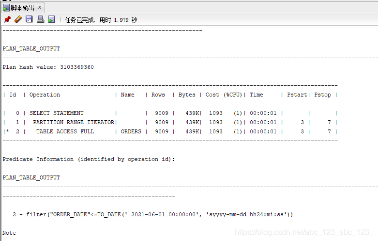
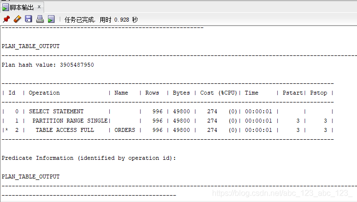
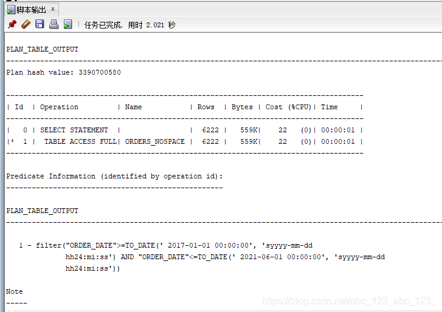
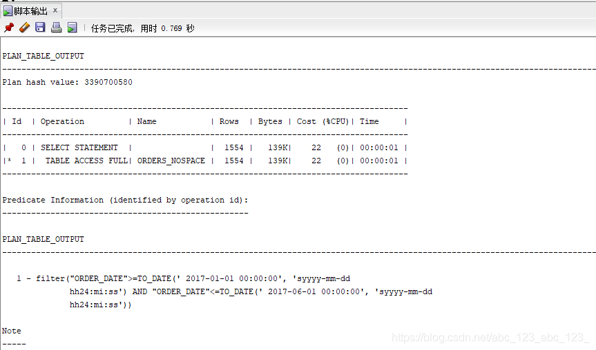

### 实验3：创建分区表

#### 实验目的

掌握分区表的创建方法，掌握各种分区方式的使用场景。

#### 实验内容

本实验使用3个表空间：USERS,USERS02,USERS03。在表空间中创建两张表：订单表(orders)与订单详表(order_details)。
使用你自己的账号创建本实验的表，表创建在上述3个分区，自定义分区策略。
你需要使用system用户给你自己的账号分配上述分区的使用权限。你需要使用system用户给你的用户分配可以查询执行计划的权限。
表创建成功后，插入数据，数据能并平均分布到各个分区。每个表的数据都应该大于1万行，对表进行联合查询。
写出插入数据的语句和查询数据的语句，并分析语句的执行计划。
进行分区与不分区的对比实验。

#### 实验步骤

##### 	1.建立无分区表

1. 在用户名LWH下建立orders表和order_details表并分区。

```sql
#建立ORDERS表并分区
CREATE TABLE ORDERS
(
  ORDER_ID NUMBER(10, 0) NOT NULL
, CUSTOMER_NAME VARCHAR2(40 BYTE) NOT NULL
, CUSTOMER_TEL VARCHAR2(40 BYTE) NOT NULL
, ORDER_DATE DATE NOT NULL
, EMPLOYEE_ID NUMBER(6, 0) NOT NULL
, DISCOUNT NUMBER(8, 2) DEFAULT 0
, TRADE_RECEIVABLE NUMBER(8, 2) DEFAULT 0
, CONSTRAINT ORDERS_PK PRIMARY KEY
  (
    ORDER_ID
  )
  USING INDEX
  (
      CREATE UNIQUE INDEX ORDERS_PK ON ORDERS (ORDER_ID ASC)
      LOGGING
      TABLESPACE USERS
      PCTFREE 10
      INITRANS 2
      STORAGE
      (
        BUFFER_POOL DEFAULT
      )
      NOPARALLEL
  )
  ENABLE
)
TABLESPACE USERS
PCTFREE 10
INITRANS 1
STORAGE
(
  BUFFER_POOL DEFAULT
)
NOCOMPRESS
NOPARALLEL
PARTITION BY RANGE (ORDER_DATE)
(
  PARTITION PARTITION_2015 VALUES LESS THAN (TO_DATE(' 2016-01-01 00:00:00', 'SYYYY-MM-DD HH24:MI:SS', 'NLS_CALENDAR=GREGORIAN'))
  NOLOGGING
  TABLESPACE USERS
  PCTFREE 10
  INITRANS 1
  STORAGE
  (
    INITIAL 8388608
    NEXT 1048576
    MINEXTENTS 1
    MAXEXTENTS UNLIMITED
    BUFFER_POOL DEFAULT
  )
  NOCOMPRESS NO INMEMORY
, PARTITION PARTITION_2016 VALUES LESS THAN (TO_DATE(' 2017-01-01 00:00:00', 'SYYYY-MM-DD HH24:MI:SS', 'NLS_CALENDAR=GREGORIAN'))
  NOLOGGING
  TABLESPACE USERS
  PCTFREE 10
  INITRANS 1
  STORAGE
  (
    BUFFER_POOL DEFAULT
  )
  NOCOMPRESS NO INMEMORY
, PARTITION PARTITION_2017 VALUES LESS THAN (TO_DATE(' 2018-01-01 00:00:00', 'SYYYY-MM-DD HH24:MI:SS', 'NLS_CALENDAR=GREGORIAN'))
  NOLOGGING
  TABLESPACE USERS
  PCTFREE 10
  INITRANS 1
  STORAGE
  (
    BUFFER_POOL DEFAULT
  )
  NOCOMPRESS NO INMEMORY
, PARTITION PARTITION_2018 VALUES LESS THAN (TO_DATE(' 2019-01-01 00:00:00', 'SYYYY-MM-DD HH24:MI:SS', 'NLS_CALENDAR=GREGORIAN'))
  NOLOGGING
  TABLESPACE USERS02
  PCTFREE 10
  INITRANS 1
  STORAGE
  (
    BUFFER_POOL DEFAULT
  )
  NOCOMPRESS NO INMEMORY
, PARTITION PARTITION_2019 VALUES LESS THAN (TO_DATE(' 2020-01-01 00:00:00', 'SYYYY-MM-DD HH24:MI:SS', 'NLS_CALENDAR=GREGORIAN'))
  NOLOGGING
  TABLESPACE USERS02
  PCTFREE 10
  INITRANS 1
  STORAGE
  (
    BUFFER_POOL DEFAULT
  )
  NOCOMPRESS NO INMEMORY
, PARTITION PARTITION_2020 VALUES LESS THAN (TO_DATE(' 2021-01-01 00:00:00', 'SYYYY-MM-DD HH24:MI:SS', 'NLS_CALENDAR=GREGORIAN'))
  NOLOGGING
  TABLESPACE USERS02
  PCTFREE 10
  INITRANS 1
  STORAGE
  (
    BUFFER_POOL DEFAULT
  )
  NOCOMPRESS NO INMEMORY
, PARTITION PARTITION_2021 VALUES LESS THAN (TO_DATE(' 2022-01-01 00:00:00', 'SYYYY-MM-DD HH24:MI:SS', 'NLS_CALENDAR=GREGORIAN'))
  NOLOGGING
  TABLESPACE USERS03
  PCTFREE 10
  INITRANS 1
  STORAGE
  (
    BUFFER_POOL DEFAULT
  )
  NOCOMPRESS NO INMEMORY
);

```

```sql
#建立order_details表并建立引用分区
CREATE TABLE order_details
(
id NUMBER(10, 0) NOT NULL
, order_id NUMBER(10, 0) NOT NULL
, product_name VARCHAR2(40 BYTE) NOT NULL
, product_num NUMBER(8, 2) NOT NULL
, product_price NUMBER(8, 2) NOT NULL
, CONSTRAINT order_details_fk1 FOREIGN KEY  (order_id)
REFERENCES orders  (  order_id   )
ENABLE
)
TABLESPACE USERS
PCTFREE 10 INITRANS 1
STORAGE (BUFFER_POOL DEFAULT )
NOCOMPRESS NOPARALLEL
PARTITION BY REFERENCE (order_details_fk1);
```


2. 分区表建立sql

分区策略：
orders表按范围分区，通过订单日期进行分区。
orders与order_details表主外键关联，所以在order_details表使用引用分区进行存储。

3.建完表如下：


##### 2.建立无分区表

1.在用户名LWH下建立orders_nospace表和order_details_space表不分区。

```sql
#orders_nospace表
CREATE TABLE ORDERS_NOSPACE 
(
  ORDER_ID NUMBER(10, 0) NOT NULL 
, CUSTOMER_NAME VARCHAR2(40 BYTE) NOT NULL 
, CUSTOMER_TEL VARCHAR2(40 BYTE) NOT NULL 
, ORDER_DATE DATE NOT NULL 
, EMPLOYEE_ID NUMBER(6, 0) DEFAULT 0 
, DISCOUNT NUMBER(8, 2) DEFAULT 0 
, CONSTRAINT ORDERS_ID_ORDERS_DETAILS PRIMARY KEY 
  (
    ORDER_ID 
  )
  USING INDEX 
  (
      CREATE UNIQUE INDEX ORDERS_ID_ORDERS_DETAILS ON ORDERS_NOSPACE (ORDER_ID ASC) 
      LOGGING 
      TABLESPACE USERS 
      PCTFREE 10 
      INITRANS 2 
      STORAGE 
      ( 
        BUFFER_POOL DEFAULT 
      ) 
      NOPARALLEL 
  )
  ENABLE 
) 
LOGGING 
TABLESPACE USERS 
PCTFREE 10 
INITRANS 1 
STORAGE 
( 
  BUFFER_POOL DEFAULT 
) 
NOCOMPRESS 
NO INMEMORY 
NOPARALLEL;

```

```sql
#建立orders_details_nospace表
CREATE TABLE ORDER_DETAILS_NOSPACE 
(
  ID NUMBER(10, 0) NOT NULL 
, ORDER_ID NUMBER(10, 0) NOT NULL 
, PRODUCT_NAME VARCHAR2(40 BYTE) NOT NULL 
, PRODUCT_NUM NUMBER(8, 2) NOT NULL 
, PRODUCT_PRICE NUMBER(8, 2) NOT NULL 
) 
LOGGING 
TABLESPACE USERS 
PCTFREE 10 
INITRANS 1 
STORAGE 
( 
  INITIAL 65536 
  NEXT 1048576 
  MINEXTENTS 1 
  MAXEXTENTS UNLIMITED 
  BUFFER_POOL DEFAULT 
) 
NOCOMPRESS 
NO INMEMORY 
NOPARALLEL;

ALTER TABLE ORDER_DETAILS_NOSPACE
ADD CONSTRAINT ORDERS_FOREIGN_ORDERS_DETAILS FOREIGN KEY
(
  ORDER_ID 
)
REFERENCES ORDERS_NOSPACE
(
  ORDER_ID 
)
ENABLE;
```

2.建立完成如图：

!(创建成功02.png)

##### 3.执行计划分析

- **有分区**
- **sql**_1


```sql
#查看不同分区的数据
set autotrace on

select * from LWH.orders where order_date
between to_date('2017-1-1','yyyy-mm-dd') and to_date('2021-6-1','yyyy-mm-dd');
```

运行结果：




- **sql_2**

#查看相同分区的数据

```sql
set autotrace on

select * from LWH.orders where order_date
between to_date('2017-1-1','yyyy-mm-dd') and to_date('2017-6-1','yyyy-mm-dd');
```

运行结果：


- **无分区**
- **sql_3**


```sql
set autotrace on

select * from LWH.orders_nospace where order_date
between to_date('2017-1-1','yyyy-mm-dd') and to_date('2021-6-1','yyyy-mm-dd');
```

运行结果：


- **sql_4**

```sql
set autotrace on

select * from SHUIJINGYELONG_1.orders_nospace where order_date
between to_date('2017-1-1','yyyy-mm-dd') and to_date('2017-6-1','yyyy-mm-dd');
```

运行结果：



#### 结论

1. **如果数据量大，分区表的优势明显加大**
2. **根据sql _1和sql_2比较，如果在分区表里查询数据，同一个分区查找明显比不同分区查找快。**
3. **如果数据量小，有分区与无分区差别不是很大，甚至无分区可能更快。**
4. **根据sql_1，sql_2和sql_3,sql_4比较，在orders数据量为10000,order_details数据量为30000时，有分区比无分区查找数据优势更大。**
