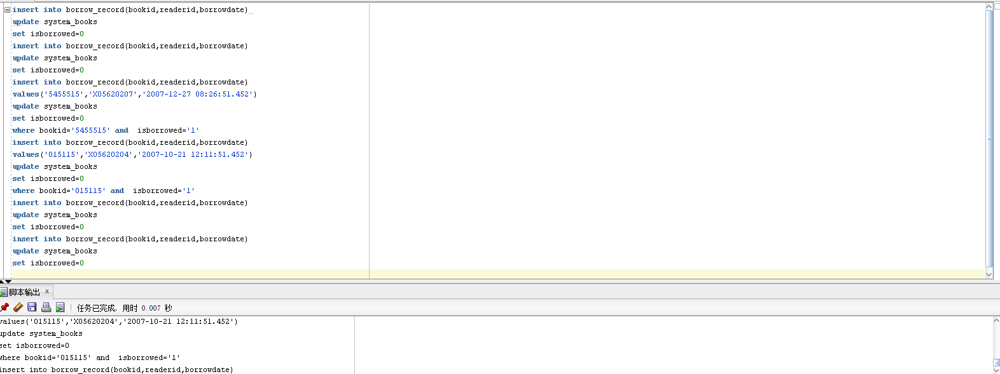

# 刘炜浩 201810414213 2018级软件工程2班


# ***\*图书管理系统数据库设计\****

## ***\*一.\*******\*系统概述\****

本系统是图书管理系统，图书管理是每个图书馆都要做的工作，一个良好的系统能够为管理图书的工作带来便利。本系统是图书管理系统的数据库设计模块，基于Oracle数据库。

## ***\*二.\*******\*需求分析\****

### ***\*数据结构分析\****

 

图书馆管理信息系统需要完成功能主要有：

(1) 读者基本信息的输入，包括借书证编号、读者姓名、读者性别。

(2) 读者基本信息的查询、修改，包括读者借书证编号、读者姓名、读者性别等。

(3) 书籍类别标准的制定、类别信息的输入，包括类别编号、类别名称。

(4) 书籍类别信息的查询、修改，包括类别编号、类别名称。

(5) 书籍库存信息的输入，包括书籍编号、书籍名称、书籍类别、作者姓名、出版社名称、出版日期、登记日期。

(6) 书籍库存信息的查询，修改，包括书籍编号、书籍名称、书籍类别、作者姓名、出版社名称、出版日期登记日期等。

(7) 借书信息的输入，包括读者借书证编号、书籍编号、借书日期。

(8) 借书信息的查询、修改，包括借书证编号、读者编号、读者姓名、书籍编号、书籍名称、借书日期等。

(9) 还书信息的输入，包括借书证编号、书籍编号、还书日期。   

(10) 还书信息的查询和修改，包括还书读者借书证编号、读者姓名、书籍编号、书籍名称、借书日期、还书日期等。

(11) 超期还书罚款输入，还书超出期限包括超出期限还书的读者借书证号，书籍编号，罚款金额。

(12) 超期还书罚款查询，删除，包括读者借书证编号、读者姓名、书籍编号、书籍名称，罚款金额等

### ***\*功能分析\****

(1)在读者信息管理部分,要求:

a.可以查询读者信息。

b.可以对读者信息进行添加及删除的操作。

(2 )在书籍信息管理部分,要求:

a.可以浏览书籍信息,要求:

b.可以对书籍信息进行维护,包括添加及删除的操作。

(3)在借阅信息管理部分,要求:。

a.可以浏览借阅信息。

b.可以对借阅信息进行维护操作。

(4)在归还信息管理部分，要求:

a.可以浏览归还信息

b.对归还信息可修改维护操作

(5)在管理者信息管理部分,要求:

a.显示当前数据库中管理者情况。

b.对管理者信息维护操作。

(6)在罚款信息管理部分,要求:

a.可以浏览罚款信息

b.对罚款信息可以更新

## ***\*三.\*******\*数据库设计方案\****

### ***\*系统E\*******\*-R\*******\*图\****

 

 

 

 

图2-1类别实体E-R图


图2-2 读者信息实体E-R图


图2-3信息实体E-R图


图2-4 记录信息实体E-R图


图2-5记录信息实体E-R图


图2-6罚款信息实体E-R图


图2-7总的信息实体E-R图

***\*设计表\****

表2-1　 book_sytle 书籍类别信息表

| 表中列名     | 数据类型 | 可否为空       | 说明     |
| ------------ | -------- | -------------- | -------- |
| book_styleno | varchar  | not null(主键) | 种类编号 |
| book_style   | Varchar  | not null       | 种类名称 |

 

表2-2　　system_readers读者信息表格

| 表中列名    | 数据类型 | 可否为空       | 说明         |
| ----------- | -------- | -------------- | ------------ |
| reader_id   | varchar  | not null(主键) | 读者借书证号 |
| reader_name | varchar  | not null       | 读者姓名     |
| reader_sex  | varchar  | not null       | 读者性别     |
| reader_type | varchar  | null           | 读者种类     |

 

表2-3　system_book书籍信息表

| 表中列名    | 数据类型 | 可否为空       | 说明       |
| ----------- | -------- | -------------- | ---------- |
| book_id     | Varchar  | Not null(主键) | 书籍编号   |
| book_name   | Varchar  | Not null       | 书籍名称   |
| book_style  | Varchar  | Not null       | 书籍类别   |
| book_author | Varchar  | Not null       | 书籍作者   |
| book_pub    | Varchar  | Null           | 出版社名称 |
| isborrowed  | Varchar  | Not Null       | 是否被借出 |

 

表2-4　borrow_record 借阅记录信息表

| 表中列名   | 数据类型 | 可否为空         | 说明           |
| ---------- | -------- | ---------------- | -------------- |
| reader_id  | Varchar  | Not null(外主键) | 读者借阅证编号 |
| book_id    | Varchar  | Not null(外主键) | 书籍编号       |
| borrowdate | Varchar  | Not null         | 读者借书时间   |

 

 

表2-5　return_record 借阅记录信息表

| 表中列名    | 数据类型 | 可否为空         | 说明           |
| ----------- | -------- | ---------------- | -------------- |
| reader_name | Varchar  | Not null(外主键) | 读者借阅证编号 |
| reader_id   | Varchar  | Not null(外主键) | 书籍编号       |

 

表2-6　reader_fee 罚款记录信息表

| reader_id   | varchar | Not null         | 读者借书证编号 |
| ----------- | ------- | ---------------- | -------------- |
| reader_name | varchar | Not null         | 读者姓名       |
| book_id     | varchar | Not null(外主键) | 书籍编号       |
| book_name   | varchar | Not null         | 书籍名称       |
| book_fee    | varchar | Not Null         | 罚款金额       |

 

 

 

##  ***\*四.\*******\*创建表\*******\*空间\****

***\*第一个表空间\****

```
Create Tablespace space_qhl001

datafile

'/home/oracle/app/oracle/oradata/orcl/pdborcl/pdbtest_qhl001_1.dbf'

 SIZE 100M AUTOEXTEND ON NEXT 256M MAXSIZE UNLIMITED,

'/home/oracle/app/oracle/oradata/orcl/pdborcl/pdbtest_qhl001_2.dbf'

 SIZE 100M AUTOEXTEND ON NEXT 256M MAXSIZE UNLIMITED

EXTENT MANAGEMENT LOCAL SEGMENT SPACE MANAGEMENT AUTO;
```

***\*第二个表空间\****

```
Create Tablespace space_qhl002

datafile

'/home/oracle/app/oracle/oradata/orcl/pdborcl/pdbtest_qhl002_1.dbf'

 SIZE 100M AUTOEXTEND ON NEXT 256M MAXSIZE UNLIMITED,

'/home/oracle/app/oracle/oradata/orcl/pdborcl/pdbtest_qhl002_2.dbf'

 SIZE 100M AUTOEXTEND ON NEXT 256M MAXSIZE UNLIMITED

EXTENT MANAGEMENT LOCAL SEGMENT SPACE MANAGEMENT AUTO;
```


#### ***\*创建表\****

***\*1、创建表空间与用户赋权\****

```
create temporary tablespace TSGL_TEMP 

tempfile '/opt/TSGL/TSGL_TEMP.dbf' 

size 50m  

autoextend on  

next 50m maxsize 20480m  

extent management local;  

create tablespace TSGL_DATA

logging  

datafile '/opt/TSGL/TSGL_DATA.dbf' 

size 50m  

autoextend on  

next 50m maxsize 20480m  

extent management local;  

create user TSGL identified by 123456

default tablespace TSGL_DATA

temporary tablespace TSGL_TEMP ;  

grant connect,resource,dba to TSGL;
```

***\*2、\*******\*书本类别表建立\****

```
create table book_style

( 

  bookstyleno varchar(30) primary key,

  bookstyle varchar(30)

);
```

 

***\*3、\*******\*创建书库表\****

```
create table system_books

( 

 bookid varchar(20) primary key,

 bookname varchar(30) Not null, 

 bookstyleno varchar(30) Not null,

 bookauthor varchar(30),

 bookpub varchar(30) ,

 bookpubdate datetime,

 bookindate datetime ,

 isborrowed varchar (2) ,

foreign key (bookstyleno) references book_style (bookstyleno)

);
```

 

 

***\*4、\*******\*借书证表建立\****

****

```
create table system_readers 

( readerid varchar(9)primary key,

 readername varchar(9)not null ,

 readersex varchar(2) not null,

 readertype varchar(10),

 regdate datetime

);
```

 

 

***\*5、\*******\*借书记录表建立\****

```
create table borrow_record

( bookid varchar(20) primary key,

 readerid varchar(9),

 borrowdate datetime,

 foreign key (bookid) references system_books(bookid),

 foreign key (readerid) references system_readers(readerid)

);
```

 

***\*6、还书记录表建立\****

```
create table return_record

( bookid varchar(20) primary key,

 readerid varchar(9),

 returndate datetime,

  foreign key (bookid) references system_books(bookid),

 foreign key (readerid) references system_readers(readerid)

);
```

 

***\*7、罚款单表建立\****

```
create table reader_fee

( readerid varchar(9)not null,

 readername varchar(9)not null ,

 bookid varchar(20) primary key,

 bookname varchar(30) Not null, 

 bookfee varchar(30) ,

 borrowdate datetime,

 foreign key (bookid) references system_books(bookid),

 foreign key (readerid) references system_readers(readerid)

);
```

 

## ***\*五.数据库实施\****

***\*1、\*******\*将书籍类别加入表book_style中\****

INSERT INTO "TSGL"."BOOK_STYLE" VALUES ('1', '人文艺术类');

 

 

```
INSERT INTO "TSGL"."BOOK_STYLE" VALUES ('2', '自然科学类');

INSERT INTO "TSGL"."BOOK_STYLE" VALUES ('3', '社会科学类');

INSERT INTO "TSGL"."BOOK_STYLE" VALUES ('4', '图片艺术类');

INSERT INTO "TSGL"."BOOK_STYLE" VALUES ('5', '政治经济类');

INSERT INTO "TSGL"."BOOK_STYLE" VALUES ('6', '工程技术类');

INSERT INTO "TSGL"."BOOK_STYLE" VALUES ('7', '语言技能类');
```

***\*2、\*******\*将已有的图书加入system_books表中\****

```
INSERT INTO "TSGL"."SYSTEM_BOOKS" VALUES ('00456456', '数据库原理', '6', '萨师煊', '高等教育出版社', TO_DATE('2001-01-03 00:00:00', 'YYYY-MM-DD HH24:MI:SS'), TO_DATE('2003-11-15 00:00:00', 'YYYY-MM-DD HH24:MI:SS'), '1');

INSERT INTO "TSGL"."SYSTEM_BOOKS" VALUES ('5455515', '中华历史5000年', '1', '吴强', '北京大学出版社', TO_DATE('2001-01-03 00:00:00', 'YYYY-MM-DD HH24:MI:SS'), TO_DATE('2003-11-15 00:00:00', 'YYYY-MM-DD HH24:MI:SS'), '0');

INSERT INTO "TSGL"."SYSTEM_BOOKS" VALUES ('015115', '古代埃及', '3', '赵文华', '北京大学出版社', TO_DATE('2001-01-03 00:00:00', 'YYYY-MM-DD HH24:MI:SS'), TO_DATE('2003-11-15 00:00:00', 'YYYY-MM-DD HH24:MI:SS'), '0');

INSERT INTO "TSGL"."SYSTEM_BOOKS" VALUES ('1514514', '日本文化', '1', '吴小鹏', '北京大学出版社', TO_DATE('2001-01-03 00:00:00', 'YYYY-MM-DD HH24:MI:SS'), TO_DATE('2003-11-15 00:00:00', 'YYYY-MM-DD HH24:MI:SS'), '1');

INSERT INTO "TSGL"."SYSTEM_BOOKS" VALUES ('5658', '影视文学', '4', '苏庆东', '北京大学出版社', TO_DATE('2001-01-03 00:00:00', 'YYYY-MM-DD HH24:MI:SS'), TO_DATE('2003-11-15 00:00:00', 'YYYY-MM-DD HH24:MI:SS'), '1');
```

 

***\*3、\*******\*将已有图书证的读者加入system_readers表中\****

```
INSERT INTO "TSGL"."SYSTEM_READERS" VALUES ('X05620206', '陈特', '男', '学生', TO_DATE('2003-11-15 00:00:00', 'YYYY-MM-DD HH24:MI:SS'));

INSERT INTO "TSGL"."SYSTEM_READERS" VALUES ('X05620207', '陈远鹏', '男', '学生', TO_DATE('2005-09-23 00:00:00', 'YYYY-MM-DD HH24:MI:SS'));

INSERT INTO "TSGL"."SYSTEM_READERS" VALUES ('X05620204', '赵铭静', '女', '学生', TO_DATE('2005-09-23 00:00:00', 'YYYY-MM-DD HH24:MI:SS'));

INSERT INTO "TSGL"."SYSTEM_READERS" VALUES ('X05620202', '潘虹', '女', '学生', TO_DATE('2005-09-23 00:00:00', 'YYYY-MM-DD HH24:MI:SS'));

INSERT INTO "TSGL"."SYSTEM_READERS" VALUES ('008415', '蒋伟', '男', '教师', TO_DATE('2005-09-23 00:00:00', 'YYYY-MM-DD HH24:MI:SS'));

INSERT INTO "TSGL"."SYSTEM_READERS" VALUES ('001456', '李叶风', '女', '教师', TO_DATE('2005-09-23 00:00:00', 'YYYY-MM-DD HH24:MI:SS'));
```

***\*4、\*******\*添加已借书读者的记录，同时将在已借出的借阅标记置\****

```
insert into borrow_record(bookid,readerid,borrowdate)

update system_books

set isborrowed=0

insert into borrow_record(bookid,readerid,borrowdate)

update system_books

set isborrowed=0

insert into borrow_record(bookid,readerid,borrowdate)

values('5455515','X05620207','2007-12-27 08:26:51.452')

update system_books

set isborrowed=0

where bookid='5455515' and  isborrowed='1'

insert into borrow_record(bookid,readerid,borrowdate)

values('015115','X05620204','2007-10-21 12:11:51.452')

update system_books

set isborrowed=0

where bookid='015115' and  isborrowed='1'

insert into borrow_record(bookid,readerid,borrowdate)

update system_books

set isborrowed=0

insert into borrow_record(bookid,readerid,borrowdate)

update system_books

set isborrowed=0
```

 

 

## ***\*触发器设计以及储存函数的设计\****

##### ***\*触发器设计\****

**1.** ***\*设计触发器borrow，当某学生借书成功后﹐图书表相应的图书不在架上,变为0∶\****

```
create or replace trigger borrow

after insert on borrow

for each row

begin

update book set book_num = book_num -1

where book_id = new.book_id;

end borrow；
```

***\*⒉设计触发器\*******\*trigger_return，还书成功后﹐对应的书籍book_num变为1:\**** 

```
create or replace trigger trigger_return

after insert on return_table

for each row

begin

update book set book_num = book_num + 1

where book_id = new.book_id;

end trigger_return;
```

***\*3.定义定时器（事件) eventJob ,每天自动触发一次﹐扫描视图stu_borrow ，若发现当前有\****

***\*预期归还时间小于当前时间\*******\*,则判断为超期,生成处罚记录,这个定时器将每天定时触发存\****

***\*储过程\*******\*proc_gen_ticket :\****

```
create event if not exists eventJob

on schedule every 1 DAYl*每天触发**

on completion PRESERVE

do call proc_gen_ticket(getdate());l*调用存储过程*/

set global event_scheduler = 1;

alter event eventJob on completion preserve enable; *开启定时器
```

***\*4.设计触发器trigger_credit ，若处罚记录超过30条,则将这个学生的诚信级设置为0，下\****

***\*次不允许借书∶\****

```
create or replace trigger trigger_credit

after insert on ticket

for each row

begin

if (select count(*) from ticket where stu_id=new.stu_id)>30 then

update student set stu_integrity = 0 where stu_id = new.stu_id;

end if;

end
```


##### ***\*储存函数包设计\****

***\*创建程序包\****

```
create or replace PACKAGE book_package Is

function func_get_credit(stu_id int) returns int;

function func_get_booknum(book_id int) returns int;

procedure proc_return(in stu_id int, in book_id int, in return_date datetime);

procedure proc_payoff(in stuid int, in bookid int);

 procedure proc_borrow(in stu_id int,in book_id int,in borrow_date datetime);

procedure proc_gen_ticket(in currentdate datetime);

procedure stu_register(in stu_id int,in stu_name varchar(20)，in stu_sex varchar(20), in stu_age int, in stu_pro varchar(20), in stu_grade varchar(20));

procedure ma_register(in ma_id int, in ma_name varchar(20), in ma_age int, in ma_phone int);

 

 
```

end book_package;

 

***\*创建储存过程\****

```
create or replace PACKAGE body book_package Is

/* 1．设计存储过程，产生罚单proc_gen_ticket :

当日期超过预定归还日期时﹐产生罚单，并将记录写入表ticket中,这个存储过程在定时器

eventJob中调用:  */

 

procedure proc_gen_ticket(in currentdate datetime)

BEGIN

declare cur_date datetime;

set cur_date = currentdate;

replace into ticket(stu_id, book_id, over_date, ticket_fee)

select

stu_id,

book_id,

datediff(cur_date,stu_borrow.expect_return_date),0.1*datediff(cur_date,stu_borrow.exp

ect_return_date)

from stu_borrow

where cur_date>stu_borrow.expect_return_date;

end proc_gen_ticket;

/* ⒉设计学生注册信息存储过程∶学生注册信息stu_register  */

 

procedure stu_register(in stu_id int,in stu_name varchar(20)，in stu_sex

varchar(20), in stu_age int, in stu_pro varchar(20), in stu_grade varchar(20))

begin

insert into student(stu_id, stu_name, stu_sex,stu_age, stu_pro, stu_grade)

values(stu_id,stu_name, stu_sex,stu_age,stu_pro,stu_grade);

end stu_register;

/*  3.设计管理员注册信息存储过程:ma_register */

 

procedure ma_register(in ma_id int, in ma_name varchar(20), in ma_age int, in

ma_phone int)

BEGIN

insert into manager

values(ma_id, ma_name, ma_age, ma_phone);

END ma_register;

 

/*  4．借书过程的实现:1)设计存储函数, func_get_credit ,返回学生的诚信级︰*/

function func_get_credit(stu_id int) returns int

begin

return(select stu_integrity from student where student.stu_id = stu_id);

end

 

/* 2)设计存储函数，func_get_booknum ,返回书籍是否在架上:*/

function func_get_booknum(book_id int) returns int

begin

return(select book_num from book where book.book_id = book_id);

end

 

/*3)设计存储过程proc_borrow ,调用func_get_credit和 func_get_booknum ,判断这

个学生诚信度和书籍是否在架上,若为真,则借书成功,在borrrow表中插入纪录;

否则提示失败︰*/

 

procedure proc_borrow(in stu_id int,in book_id int,in borrow_date datetime)

begin

if func_get_credit(stu_id)= 1 and func_get_booknum(book_id)= 1 then

insert into borrow

values(stu_id, book_id, borrow_date);

else

select 'failed to borrow';

end if;

end proc_borrow;

 

/* 5.还书存储过程proc_return :

当还书时,查看是否书是否超期,即查询ticket表项,当发现超期,提示交罚单后再次还书 ，

如没有超期，则纪录归还项目到return_table中，并且删除借书纪录(以免还书后定时器仍

然扫描这个纪录): */

procedure proc_return(in stu_id int, in book_id int, in return_date datetime)

begin

DECLARE borrowdate datetime;

if(select payoff from ticket where ticket.stu_id =stu_idand

ticket.book_id=book_id)= 1 then l*判断是否交了罚单﹐1表示没有交*

select 'please pay off the ticket';

elsel*纪录归还项目到return_table 中，并且删除借书纪录*/

set borrowdate = (select borrow_date from borrow where borrow.stu_id =

stu_id and borrow.book_id = book_id);

insert into return_table

values(stu_id, book_id, borrowdate, return_date);

delete from borrow

where borrow.stu_id = stu_id and borrow.book_id = book_id;

end if;

end proc_return;

 

/* 6.交罚单存储过程∶修改罚单中payoff 段为0，表明罚单已交∶  */

procedure proc_payoff(in stuid int, in bookid int)

begin

update ticket

set payoff = o

where ticket.stu_id = stuid and ticket.book_id = bookid;

select 'succeed';

end proc_payoff;

end book_package;
```

 

 

## ***\*六.\*******\*备份\****

一、原理

 

写一个数据库备份、删除脚本，加入到windows任务计划里，每天定时执行即可；

二、步骤

 

1、 新建txt文档，输入如下“oracle数据库定时备份、删除脚本”内容

2、 脚本内容如下：

 

```
@echo off  

echo ================================================  

echo  Windows环境下Oracle数据库的自动备份脚本  

echo  1. 使用当前日期命名备份文件。  

echo  2. 自动删除7天前的备份。  

echo ================================================  

::以“YYYYMMDD”格式取出当前时间。  

set BACKUPDATE=%date:~0,4%%date:~5,2%%date:~8,2%  

::设置用户名、密码和要备份的数据库。  

set USERA=sccot

set PASSWORD=123456

set SID=orcl

::创建备份目录。  

if not exist "C:\oraclebackup\data"    mkdir C:\oraclebackup\data  

if not exist "C:\oraclebackup\log"     mkdir C:\oraclebackup\log  

set DATADIR=C:\oraclebackup\data  

set LOGDIR=C:\oraclebackup\log  

exp %USERA%/%PASSWORD%@%SID%  file=%DATADIR%\%BACKUPDATE%.dmp 

::删除7天前的备份。  

forfiles /p "%DATADIR%" /s /m *.* /d -7 /c "cmd /c del @path"  

forfiles /p "%LOGDIR%" /s /m *.* /d -7 /c "cmd /c del @path"  

exit  

3另存为.bat格式

\4. windows定时添加任务
```

 

## ***\*七.总结\****

通过此次数据库的课程设计，我oracle对数据库有了更深刻的理解，对E-R图的设计、表的创建也更加熟练了，对做一个系统的流程也有了深刻的认识。希望在以后的学习里再接再厉，做一个优秀的程序员。

 